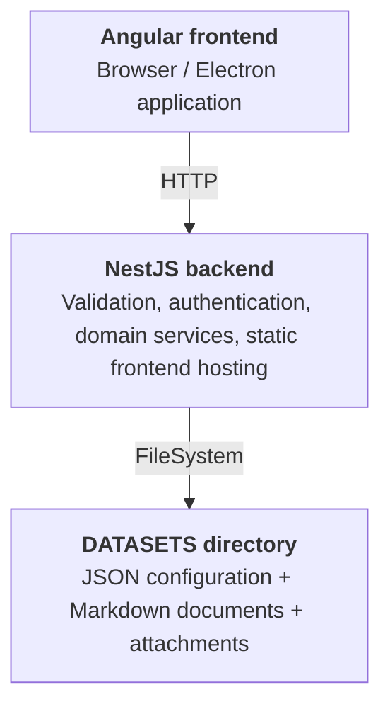
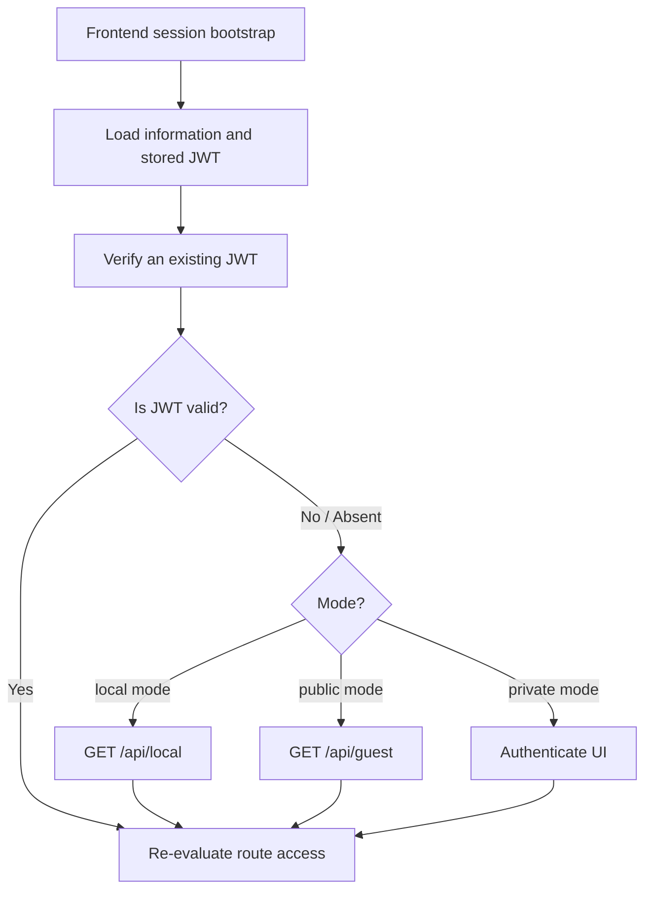
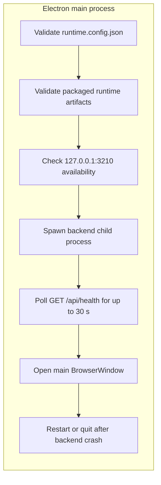
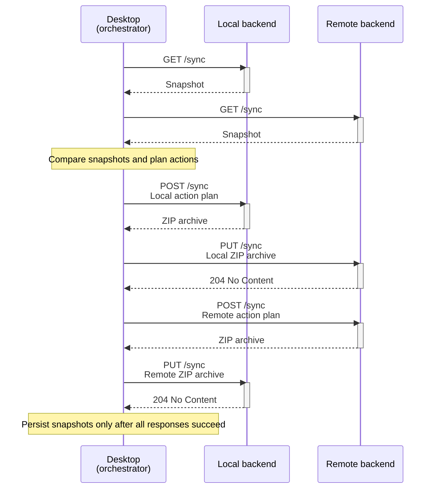

# Wiki|Docs Technical Architecture

Wiki|Docs is a lightweight, databaseless wiki designed for maximum portability and simplicity.

It stores configuration and metadata as JSON, document content as Markdown with frontmatter, and attachments as regular
files.

The same Angular frontend and NestJS backend run in hosted, containerized, and Electron desktop deployments.

This document describes runtime boundaries, persistent formats, cross-layer contracts, HTTP APIs, and development
invariants. It intentionally excludes UI composition, build instructions, and release procedures.

## Sources of truth

When artifacts disagree, use this precedence:

1. `shared/contracts/index.ts` is authoritative for cross-layer payload shapes.
2. `backend/src/app.controller.ts`, `backend/src/app.guard.ts`, and backend schemas are authoritative for the HTTP 
   surface, access control, validation, and transport behavior.
3. This document is authoritative for intended architecture, runtime boundaries, and cross-layer invariants.

Contract, endpoint, and architectural changes must update all affected sources in the same change set.

### Source map

| Concern                           | Authoritative source                                                 |
|-----------------------------------|----------------------------------------------------------------------|
| Shared payloads                   | `shared/contracts/index.ts`                                          |
| Backend bootstrap and environment | `backend/src/main.ts`, `backend/src/services/environment.service.ts` |
| HTTP API and authorization        | `backend/src/app.controller.ts`, `backend/src/app.guard.ts`          |
| Dataset operations                | `backend/src/services/index.ts`                                      |
| Frontend routing and access       | `frontend/src/app/app.routes.ts`, `frontend/src/app/app.guard.ts`    |
| Frontend session lifecycle        | `frontend/src/app/services/session.service.ts`                       |
| Desktop runtime                   | `desktop/src/index.ts`, `desktop/src/settings.preload.ts`            |
| Desktop packaging                 | `desktop/forge.config.ts`                                            |

## Runtime topology

All deployments expose the frontend at `/` and the backend API under `/api`. Swagger UI is exposed at `/api/` and its
OpenAPI JSON document at `/api-json/`.



The backend uses a global `ValidationPipe` with transformation, whitelisting, and rejection of non-whitelisted
properties. CORS is enabled. If `FRONTEND` is configured, the backend serves its static files and returns `index.html`
for non-API, extensionless routes.

### Deployment variants

| Variant | Runtime behavior                                                                                                 |
|---------|------------------------------------------------------------------------------------------------------------------|
| Watch   | Backend and frontend may run separately during development in watch mode.                                        |
| Docker  | A single Node.js process serves the built Angular application at `/` and the Nest API at `/api`.                 |
| Desktop | Electron starts the packaged backend as a child process and then loads the packaged frontend in its main window. |

## Runtime configuration

The backend validates required environment variables before NestJS starts. Invalid configuration terminates the process.

| Variable   | Required | Meaning                                                                                     |
|------------|----------|---------------------------------------------------------------------------------------------|
| `MODE`     | Yes      | Runtime mode: `local`, `private`, or `public`.                                              |
| `SECRET`   | Yes      | HMAC/JWT secret used for passwords, session tokens, and attachment tokens.                  |
| `DATASETS` | Yes      | Existing writable dataset root directory.                                                   |
| `PORT`     | No       | Backend listening port, default `3000`.                                                     |
| `FRONTEND` | No       | Readable Angular browser bundle directory containing `index.html` to enables static hosting |

Runtime modes affect authentication:

| Mode      | Bootstrap session | Account authentication | Initialization password |
|-----------|-------------------|------------------------|-------------------------|
| `local`   | `GET /api/local`  | Disabled               | Must be `null`.         |
| `public`  | `GET /api/guest`  | Enabled                | Required.               |
| `private` | None              | Enabled                | Required.               |

## Dataset

The dataset is a single directory selected through `DATASETS` environment variable.

```
┌─────────────────────────────────────────┐
│ DATASETS                                │
├─────────────────────────────────────────┤
│ /                                       │
│ ├── settings.json                       │
│ ├── accounts.json                       │
│ ├── pinned.json                         │
│ ├── documents/                          │
│ └── trash/                              │
└─────────────────────────────────────────┘
```

Initialization creates all three JSON files, both directories, and the root `documents/content.md`. The backend does not
use a database or maintain a secondary index.

## Shared contracts

`shared/contracts` is the cross-layer contract source of truth. It contains type definitions only. Backend schemas add
runtime validation while remaining semantically aligned with these contracts. Frontend-local types use bidirectional 
compile-time shape guards against the shared contracts.

## Backend HTTP API

Every route is prefixed with `/api`. Public routes bypass the global guard. Other routes require a valid bearer JWT;
routes with an authorization additionally require at least one authorization declared by the endpoint.

| Method   | Path                | Access     | Purpose                                                   |
|----------|---------------------|------------|-----------------------------------------------------------|
| `GET`    | `/api/health`       | Public     | Return `204` when initialized; return `501` otherwise.    |
| `GET`    | `/api/information`  | Public     | Return runtime information and initialization state.      |
| `POST`   | `/api/initialize`   | Public     | Initialize an empty dataset.                              |
| `HEAD`   | `/api/token`        | JWT        | Verify the bearer token and referenced account existence. |
| `GET`    | `/api/guest`        | Public     | Issue a guest token in public mode.                       |
| `GET`    | `/api/local`        | Public     | Issue a local administrator token in local mode.          |
| `POST`   | `/api/authenticate` | Public     | Authenticate an account and issue a token.                |
| `PATCH`  | `/api/profile`      | JWT        | Update the current account profile.                       |
| `GET`    | `/api/settings`     | Public     | Retrieve settings.                                        |
| `PUT`    | `/api/settings`     | `manage`   | Overwrite settings.                                       |
| `GET`    | `/api/accounts`     | `manage`   | Retrieve accounts without password hashes.                |
| `POST`   | `/api/accounts`     | `manage`   | Upsert accounts.                                          |
| `DELETE` | `/api/accounts`     | `manage`   | Delete the account selected by `account`.                 |
| `GET`    | `/api/pinned`       | `read`     | Retrieve pinned document metadata.                        |
| `POST`   | `/api/pinned`       | `write`    | Pin the document selected by `path`.                      |
| `PATCH`  | `/api/pinned`       | `write`    | Move `path` to `sorting`.                                 |
| `DELETE` | `/api/pinned`       | `write`    | Unpin `path`.                                             |
| `GET`    | `/api/search`       | `read`     | Search document bodies for `query`.                       |
| `GET`    | `/api/tree`         | `read`     | Retrieve direct children of `path`.                       |
| `GET`    | `/api/document`     | `read`     | Retrieve `path`.                                          |
| `POST`   | `/api/document`     | `write`    | Create or replace `path`.                                 |
| `PATCH`  | `/api/document`     | `write`    | Move `path` to `destination`.                             |
| `DELETE` | `/api/document`     | `delete`   | Move `path` to trash.                                     |
| `GET`    | `/api/attachment`   | Signed URL | Retrieve `file` under `path` using an attachment token.   |
| `POST`   | `/api/attachment`   | `write`    | Upload multipart `file` under `path`.                     |
| `DELETE` | `/api/attachment`   | `delete`   | Delete `file` under `path`.                               |
| `GET`    | `/api/trash`        | `delete`   | Retrieve deleted document metadata.                       |
| `PATCH`  | `/api/trash`        | `delete`   | Restore trash `path` under `destination`.                 |
| `DELETE` | `/api/trash`        | `delete`   | Permanently remove trash `path`.                          |
| `GET`    | `/api/sync`         | `sync`     | Retrieve the current synchronization snapshot.            |
| `POST`   | `/api/sync`         | `sync`     | Apply actions and return a ZIP archive changes.           |
| `PUT`    | `/api/sync`         | `sync`     | Import a ZIP archive with changes.                        |

## Information and initialization

`GET /api/information` returns process and runtime state.

```
┌─────────────────────────────────────────┐
│ InformationContract                     │
├─────────────────────────────────────────┤
│ Properties:                             │
│ ├── mode: local | private | public      │
│ ├── initialized: boolean                │
│ ├── service: string                     │
│ ├── version: string                     │
│ ├── host: string                        │
│ ├── platform: string                    │
│ ├── engine: string                      │
│ ├── pid: number                         │
│ ├── uptime: number                      │
│ └── memory: number                      │
└─────────────────────────────────────────┘
```

The dataset is initialized only when both `settings.json` and `accounts.json` exist. `POST /api/initialize` is accepted
only while uninitialized.

```
┌─────────────────────────────────────────┐
│ InitializationContract                  │
├─────────────────────────────────────────┤
│ Properties:                             │
│ ├── title: string                       │
│ ├── account: string                     │
│ ├── firstname: string                   │
│ ├── lastname: string                    │
│ └── password: null | string             │
└─────────────────────────────────────────┘
```

Initialization creates default settings, one administrator account, an empty pinned list, the document and trash
directories, and a root document. Password must be `null` in local mode and non-null in public or private mode.

## Settings

Settings are stored in `settings.json`.

```json
{
  "title": "Wiki|Docs",
  "subtitle": "lightweight, databaseless wiki",
  "owner": "John Doe",
  "notice": "Copyright © John Doe - All Rights Reserved",
  "privacy": "Privacy policy banner content",
  "localization": "en",
  "timezone": "Europe/Rome",
  "template": "light",
  "color": "#4caf50"
}
```

```
┌─────────────────────────────────────────┐
│ SettingsContract                        │
├─────────────────────────────────────────┤
│ Properties:                             │
│ ├── title: string                       │
│ ├── subtitle: string                    │
│ ├── owner: string                       │
│ ├── notice: string                      │
│ ├── privacy: null | string              │
│ ├── localization: en | it | ...         │
│ ├── timezone: string                    │
│ ├── template: light | dark | ...        │
│ └── color: string                       │
└─────────────────────────────────────────┘
```

## Authentication and authorization

Session authentication uses signed JWTs. The JWT is sent as `Authorization: Bearer <token>`. The guard verifies the
signature and expiration before evaluating endpoint authorizations. `HEAD /api/token` also verifies that non-guest
tokens still refer to an existing persisted account.

```
┌─────────────────────────────────────────┐
│ AuthenticateContract                    │
├─────────────────────────────────────────┤
│ Properties:                             │
│ ├── account: string                     │
│ ├── password: string                    │
│ └── duration?: number                   │
└─────────────────────────────────────────┘

┌─────────────────────────────────────────┐
│ JwtContract                             │
├─────────────────────────────────────────┤
│ Properties:                             │
│ └── jwt: string                         │
└─────────────────────────────────────────┘

┌─────────────────────────────────────────┐
│ TokenContract                           │
├─────────────────────────────────────────┤
│ Properties:                             │
│ ├── duration: number                    │
│ ├── generation: string                  │
│ ├── expiration: string                  │
│ ├── account: string                     │
│ ├── firstname: string                   │
│ ├── lastname: string                    │
│ ├── role: string                        │
│ └── authorizations: string[]            │
└─────────────────────────────────────────┘
```

Supported authorizations are `read`, `write`, `delete`, `sync`, and `manage`.

| Role            | Authorizations                              |
|-----------------|---------------------------------------------|
| `guest`         | `read`                                      |
| `local`         | `read`, `write`, `delete`, `sync`, `manage` |
| `user`          | `read`                                      |
| `author`        | `read`, `write`, `delete`                   |
| `administrator` | `read`, `write`, `delete`, `sync`, `manage` |

`guest` and `local` are session roles, not persisted account roles. Guest tokens are available only in public mode. 
Local tokens are available only in local mode and use the first persisted account identity. Account passwords are stored
as SHA-256 HMAC digests keyed by `SECRET`; raw passwords are never returned.

## Accounts and profile

Accounts are stored in `accounts.json`.

```json
[
  {
    "account": "john.doe@wikidocs.app",
    "firstname": "John",
    "lastname": "Doe",
    "role": "administrator",
    "password": "H4$h3d-p4$$w0Rd"
  }
]
```

```
┌─────────────────────────────────────────┐
│ AccountContract                         │
├─────────────────────────────────────────┤
│ Properties:                             │
│ ├── account: string                     │
│ ├── firstname: string                   │
│ ├── lastname: string                    │
│ ├── role: administrator | author | user │
│ └── password?: string | null            │
└─────────────────────────────────────────┘

┌─────────────────────────────────────────┐
│ AccountsContract                        │
├─────────────────────────────────────────┤
│ Properties:                             │
│ └── accounts: AccountContract[]         │
└─────────────────────────────────────────┘

┌─────────────────────────────────────────┐
│ ProfileContract                         │
├─────────────────────────────────────────┤
│ Properties:                             │
│ ├── firstname: string                   │
│ ├── lastname: string                    │
│ └── password?: null | string            │
└─────────────────────────────────────────┘
```

Account responses omit password hashes. Profile updates act on the identity in the bearer token and can change first
name, last name, and optionally password.

## Documents

A document node is a slug-normalized directory under `documents/`. Each directory may contain `content.md`, direct file
attachments, child document directories, and `_versions`. A directory without `content.md` is an index-only node.

```
┌─────────────────────────────────────────┐
│ documents/                              │
├─────────────────────────────────────────┤
│ └── countries/                          │
│     └── italy/                          │
│         ├── content.md                  │
│         ├── map.jpg                     │
│         ├── milan/                      │
│         ├── rome/                       │
│         └── _versions/                  │
│             └── 1780000000000.md        │
└─────────────────────────────────────────┘
```

Document paths are trimmed, lowercased, slash-normalized, and restricted to `a-z`, digits, `_`, `.`, `-`, and `/`.
Traversal segments and `_versions` in API paths are rejected.

`content.md` contains frontmatter and Markdown:

```markdown
---
title: Hello World
timestamp: 2026-06-19T09:18:28.000Z
author: John Doe <john.doe@wikidocs.app>
tags: 
  - test
---
This is the document body.
```

On store, the backend assigns the current timestamp, fills a missing title from the final path segment, fills a missing
author from the session token, and defaults missing tags to an empty array. When the optional `versioning` request flag
is `true` and `content.md` already exists, the backend first copies the current file to
`_versions/<unixTimestampMilliseconds>.md`. The snapshot copy must succeed before the document is overwritten; a failed
copy fails the store operation. New documents never create a version. `_versions` is an internal archive and is not
exposed through document APIs.

```
┌─────────────────────────────────────────┐
│ MetadataContract                        │
├─────────────────────────────────────────┤
│ Properties:                             │
│ ├── path: string                        │
│ ├── title: string                       │
│ ├── timestamp: string                   │
│ ├── author: string                      │
│ └── tags: string[]                      │
└─────────────────────────────────────────┘

┌─────────────────────────────────────────┐
│ AttachmentContract                      │
├─────────────────────────────────────────┤
│ Properties:                             │
│ ├── path: string                        │
│ ├── file: string                        │
│ └── token: string                       │
└─────────────────────────────────────────┘

┌─────────────────────────────────────────┐
│ ContentContract                         │
├─────────────────────────────────────────┤
│ Properties:                             │
│ ├── raw: string                         │
│ └── versioning?: boolean                 │
└─────────────────────────────────────────┘

┌─────────────────────────────────────────┐
│ DocumentContract                        │
├─────────────────────────────────────────┤
│ Properties:                             │
│ ├── exists: boolean                     │
│ ├── pinned: boolean                     │
│ ├── metadata: MetadataContract          │
│ ├── children: MetadataContract[]        │
│ ├── attachments: AttachmentContract[]   │
│ └── content: ContentContract            │
└─────────────────────────────────────────┘
```

Attachment retrieval is public but requires the document response's signed attachment token. The token binds normalized
path, file name, and a 24-hour expiration using an HMAC-SHA-256 signature keyed by `SECRET`.

Deleting a document moves its complete directory to `trash/<unixTimestamp>_<slug>`. Restoration recreates the requested
destination parent and fails on a destination collision. Permanent removal recursively deletes the trash entry.

```
┌─────────────────────────────────────────┐
│ TrashContract                           │
├─────────────────────────────────────────┤
│ Properties:                             │
│ └── documents: MetadataContract[]       │
└─────────────────────────────────────────┘
```

## Tree, search, and pinned documents

Tree retrieval returns direct child metadata without loading document content.

```
┌─────────────────────────────────────────┐
│ TreeContract                            │
├─────────────────────────────────────────┤
│ Properties:                             │
│ └── leaves: MetadataContract[]          │
└─────────────────────────────────────────┘
```

Search recursively scans document bodies. Queries are non-empty, case-insensitive literal phrases with whole-word
boundaries. Each match produces a sentence-scoped highlight, capped at 180 characters and marked with `==`.

```
┌─────────────────────────────────────────┐
│ SearchContract                          │
├─────────────────────────────────────────┤
│ Properties:                             │
│ └── results: SearchResult[]             │
│     ├── metadata: MetadataContract      │
│     └── highlights: string[]            │
└─────────────────────────────────────────┘
```

Pinned document paths are stored as an ordered array in `pinned.json`; retrieval resolves them to document metadata.

```json
[
  { "path": "/countries/italy/milan" },
  { "path": "/countries/italy/rome" }
]
```

```
┌─────────────────────────────────────────┐
│ PinnedContract                          │
├─────────────────────────────────────────┤
│ Properties:                             │
│ └── documents: MetadataContract[]       │
└─────────────────────────────────────────┘
```

## Frontend runtime

The Angular application uses standalone components and hash-based routing. In development, a browser running on
`http://localhost:4200` calls `http://localhost:3000/api`; all other deployments use same-origin `/api`.

| Route             | Access policy                                |
|-------------------|----------------------------------------------|
| `/#/wait`         | Public                                       |
| `/#/authenticate` | Public                                       |
| `/#/profile`      | Authenticated non-guest session              |
| `/#/accounts`     | `manage`; redirects to profile in local mode |
| `/#/settings`     | `manage`                                     |
| `/#/search`       | `read`                                       |
| `/#/trash`        | `delete`                                     |
| `/#/**`           | `read`                                       |

The application initializer loads runtime information and Markdown plugins. While the dataset is uninitialized, route
guards allow initialization UI access regardless of normal route policy.

### Session lifecycle

The frontend stores the encoded session token in `localStorage` under `JWT`, decodes its payload into Angular signals,
schedules expiration, and verifies persisted or newly issued tokens through `HEAD /api/token`.



Guest sessions satisfy `read` authorization routes but not the `authenticated` profile route. Expired sessions are
destroyed and the mode-specific bootstrap flow runs again.

## Desktop runtime

The Electron main process owns filesystem configuration, backend process lifecycle, native dialogs, windows, and IPC.
The Angular renderer does not receive Node.js APIs.

Desktop configuration is stored at Electron's `userData/runtime.config.json`:

```json
{
  "datasets": "<absolute path to dataset directory>",
  "secret": "at-least-32-characters"
}
```

On first run, Electron prompts for an existing writable dataset directory and generates a random secret. Existing
configuration is validated at startup. The settings window can replace both values; saving stops the backend and
relaunches the whole application.



The child process receives `MODE=local`, `PORT=3210`, `DATASETS`, `SECRET`, `FRONTEND`, and `ELECTRON_RUN_AS_NODE=1`. 
Readiness accepts health status `204` or `501`, because an uninitialized backend must still allow the initialization UI
to load.

The settings window runs with Node integration disabled and context isolation enabled. Its preload exposes only:

| IPC channel                     | Renderer API                | Purpose                                     |
|---------------------------------|-----------------------------|---------------------------------------------|
| `settings:get-runtime-config`   | `loadRuntimeConfig()`       | Read current desktop runtime configuration. |
| `settings:browse-datasets-path` | `browseDatasetsPath()`      | Open the native directory picker.           |
| `settings:save-runtime-config`  | `saveRuntimeConfig(config)` | Validate, persist, and relaunch.            |

Packaged desktop artifacts include the backend distribution and dependencies, the Angular browser bundle, and icons.
The main application window loads the local backend origin; the separate settings window uses its dedicated preload
bridge.

## Synchronization

Synchronization replicates the active document tree between a local backend managed by the desktop application and a
remote backend. The desktop application is the sync orchestrator: backends expose their current state and apply the
actions and archives received from the orchestrator, but do not compare snapshots or retain synchronization state.

Only documents under `documents` are synchronized. The `trash` directory, settings, accounts, and pinned documents are
local to each dataset. A document snapshot includes `content.md`, its direct attachments and their modification times.
The latest modification time among those files is the document time. The `_versions` directory is excluded from snapshot
time calculation but is included when a document is transferred.

The three synchronization endpoints require the `sync` authorization.
Local tokens and administrator tokens include this authorization.

### Contracts

The snapshot contract describes the active documents currently available in one backend. Paths are normalized document
paths prefixed with `/`, sorted lexicographically, and times are Unix timestamps in milliseconds.

```
┌─────────────────────────────────────────┐
│ SnapshotContract                        │
├─────────────────────────────────────────┤
│ Properties:                             │
│ ├── timestamp: string                   │
│ └── documents: SnapshotDocument[]       │
│     ├── path: string                    │
│     └── time: number                    │
└─────────────────────────────────────────┘
```

The `timestamp` is the UTC instant at which the backend generated the snapshot. It identifies the snapshot response and
is not used to resolve document conflicts.

The actions contract is the input for an exchange operation. `retrieve` identifies documents to export in the response
archive, while `delete` identifies documents to remove locally.

```
┌─────────────────────────────────────────┐
│ ActionsContract                         │
├─────────────────────────────────────────┤
│ Properties:                             │
│ ├── retrieve: string[]                  │
│ └── delete: string[]                    │
└─────────────────────────────────────────┘
```

Each path is normalized by the backend and duplicate paths are removed. A path cannot occur in both arrays.

### Exchange flow

The desktop application retrieves both snapshots, compares them with the snapshots persisted after the previous
successful synchronization, then computes one action set for each backend. For each action set, it requests the source
archive with `POST /sync` and uploads that archive to the opposite backend with `PUT /sync`.



On the first synchronization, when either persisted snapshot is unavailable, the desktop application merges both active
document sets without propagating deletions. For a path that exists in both backends, the document with the latest
`time` is transferred to the other backend. Equal times are equivalent and require no transfer.

On subsequent synchronizations, the desktop application infers deletions by comparing each current snapshot with its
previous snapshot. A deletion is propagated unless the opposite backend modified the same path after the previous
synchronization. Renames and moves are represented as a deletion at the former path and a creation at the new path.
The action plan is fixed before any exchange starts. If an operation fails, the desktop application does not persist
new snapshots, so a later synchronization recomputes the plan from the previous successful state.

### Operations

`GET /sync` returns the current `SnapshotContract`.

`POST /sync` receives an `ActionsContract` and returns a ZIP archive. The backend creates and validates the complete
archive before applying deletions. Requested documents that do not exist cause the operation to fail. Deletions use the
regular document removal flow and therefore move documents and their attachments to the trash. An already absent
document is treated as already removed.

`PUT /sync` receives a ZIP archive in the request. The backend validates the archive before writing it: entries must be
regular files or directories, cannot contain symbolic links, duplicate paths, traversal segments, or invalid document 
and attachment names, and every imported document must include `content.md`. Imported files are staged in a temporary
directory before they replace their destination document. File timestamps from the archive are preserved.

Only one `POST /sync` or `PUT /sync` operation can run in a backend at a time. A concurrent operation fails with a
conflict response. Import is not transactional across multiple documents: valid documents may already have been applied
when a later file operation fails.

### Archive source

The archive contains each requested document directory relative to `documents/`. It includes the document content, its
direct attachments, and, when present, direct files from its `_versions/` directory.

```
/countries/italy/rome/content.md
/countries/italy/rome/image.jpg
/countries/italy/rome/_versions/20260727091827.md
```

Archive entries cannot introduce nested attachment directories. A document is identified by its `content.md` entry; all
other files must be direct attachments or direct files under that document's `_versions/` directory.
