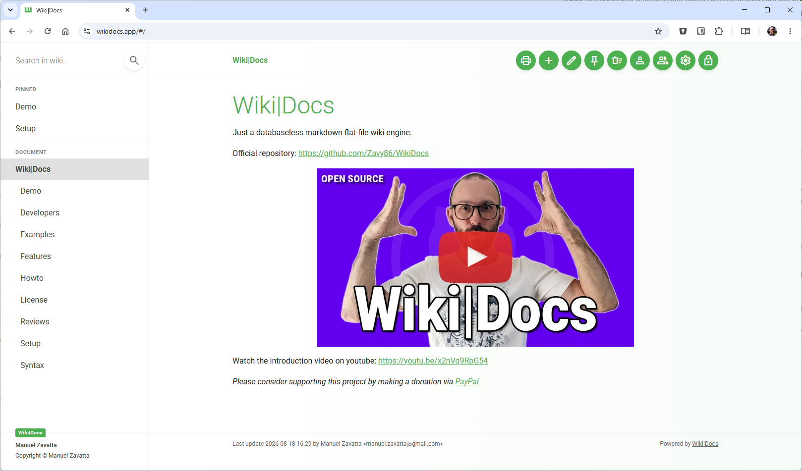
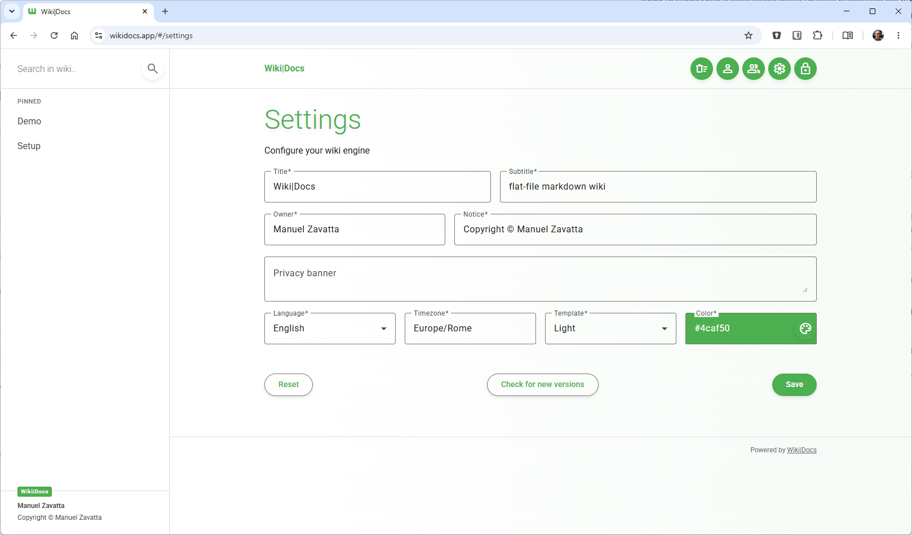
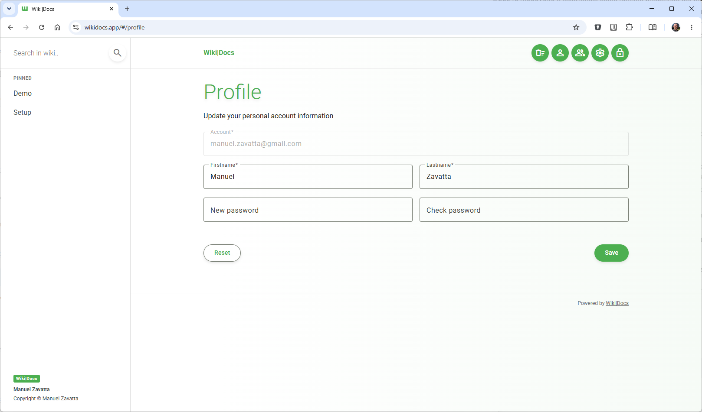
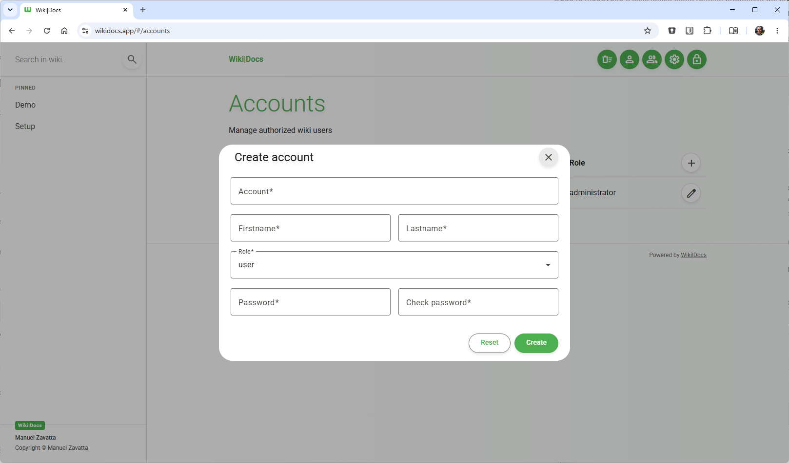
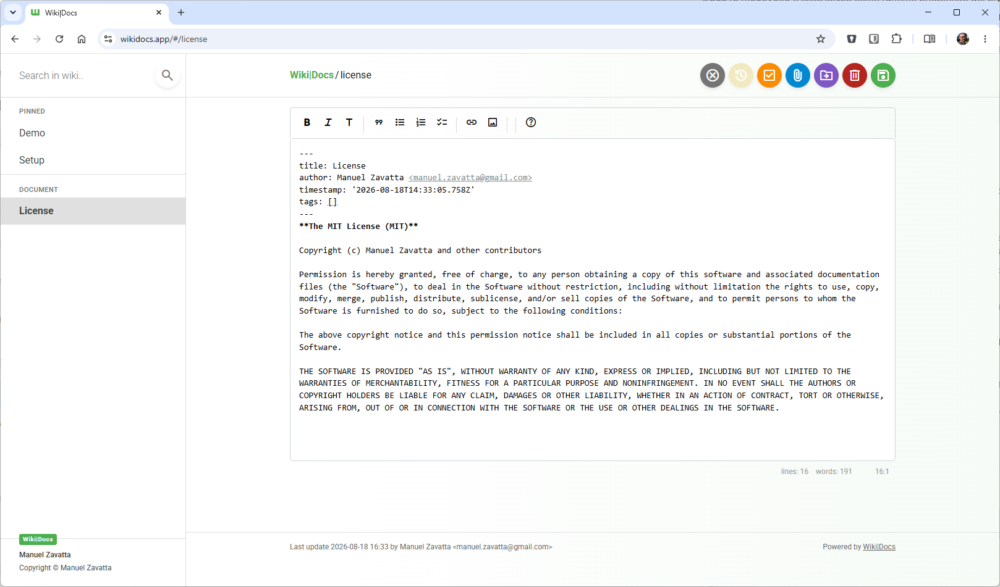
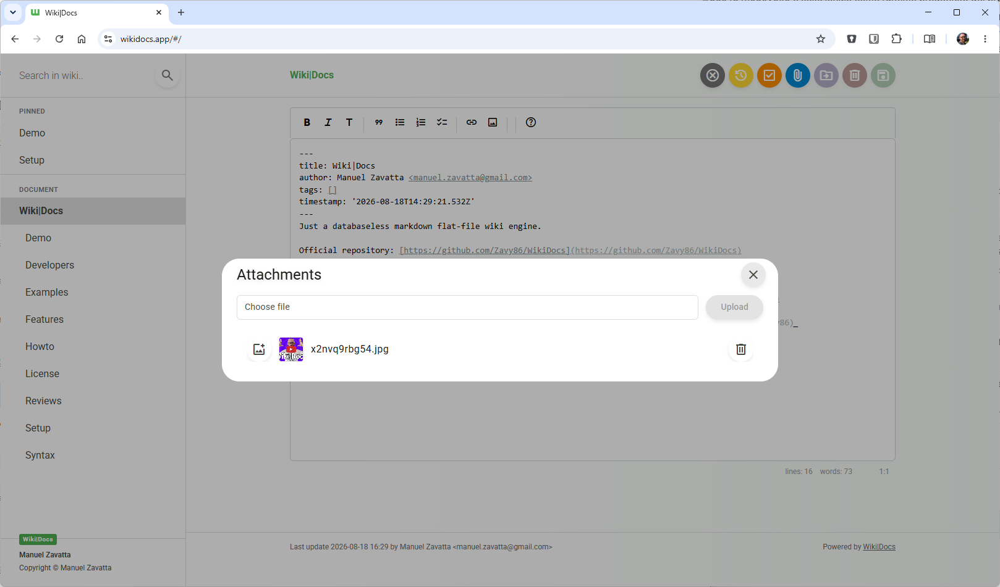
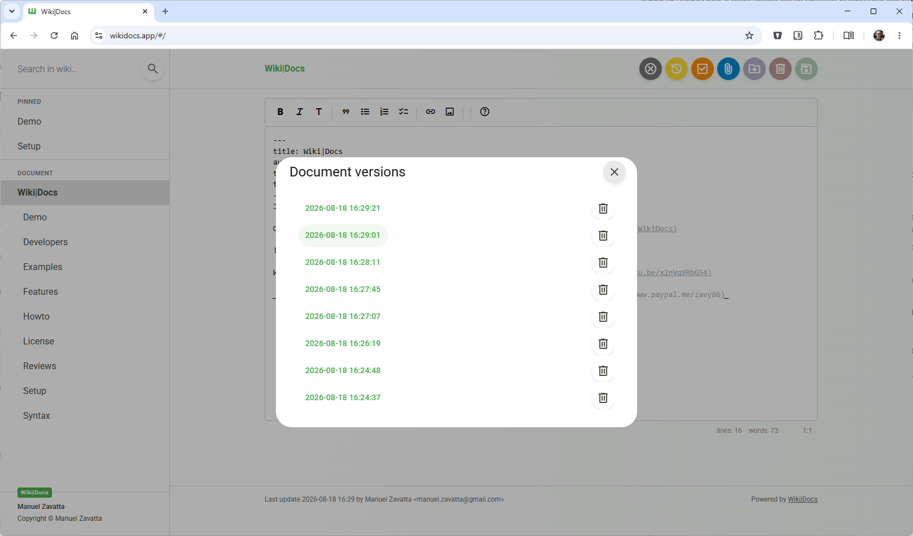
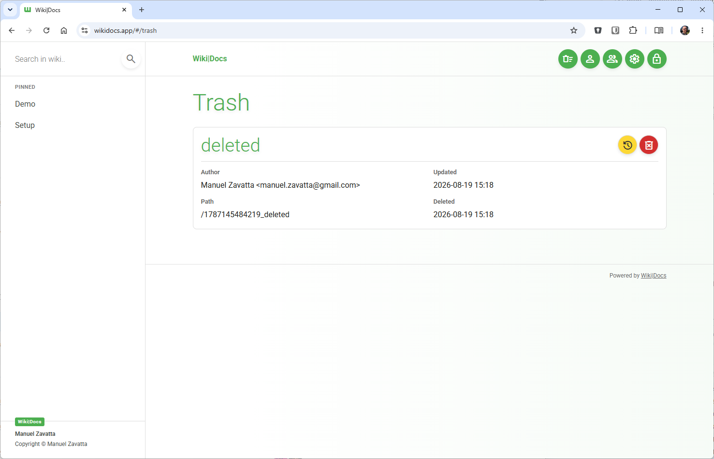
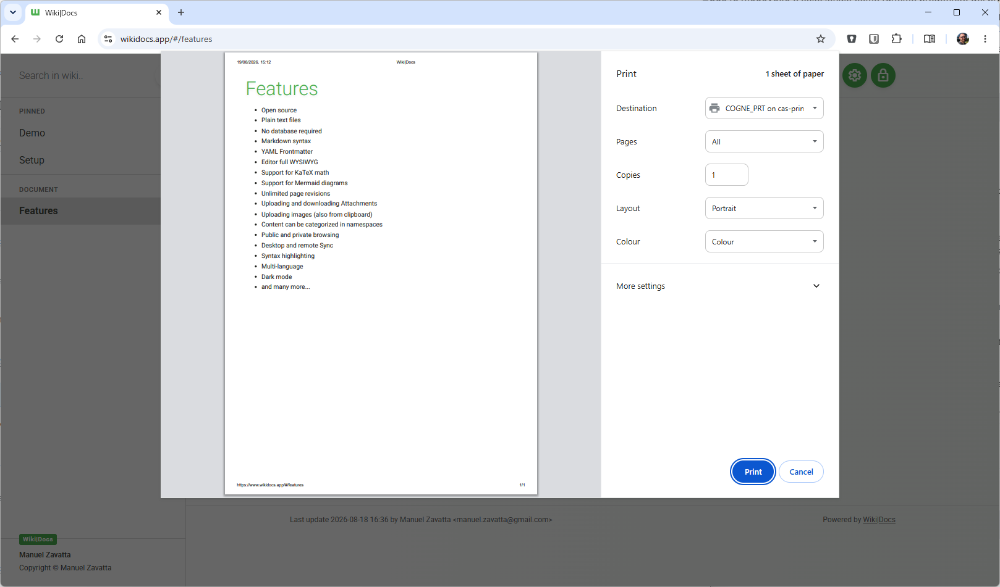
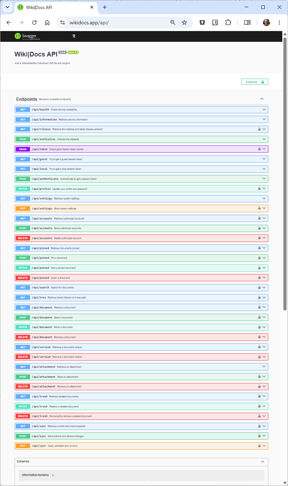

# Wiki|Docs

Just a databaseless markdown flat-file wiki.

Project homepage: [https://www.wikidocs.app](https://www.wikidocs.app)

> This is the new version of Wiki|Docs, a complete rewrite of the original project.
> 
> The new version is based on a modern architecture with API, a web client, and a desktop application.
> 
> If you are looking for the oldest version of the project written in PHP, please follow
> [this branch](https://github.com/Zavy86/WikiDocs/tree/legacy).

_Please consider supporting this project by making a donation via [PayPal](https://www.paypal.me/zavy86)_.

[](https://youtu.be/x2nVq9RbG54 "Watch Wiki|Docs presentation and contributors recruitment on YouTube")


## Features

- Open source
- Plain text files
- No database required
- Markdown syntax
- YAML Frontmatter
- Editor full WYSIWYG
- Support for KaTeX math
- Support for Mermaid diagrams
- Unlimited page revisions
- Uploading and downloading Attachments
- Uploading images (also from clipboard)
- Content can be categorized in namespaces
- Public and private browsing
- Desktop and remote Sync
- Syntax highlighting
- Multi-language
- Dark mode
- and many more...


## Screenshots

<p align="center">
  <a href="screenshots/wikidocs-homepage.png" target="_blank"></a>
  <a href="screenshots/wikidocs-settings.png" target="_blank"></a>
  <a href="screenshots/wikidocs-profile.png" target="_blank"></a>
</p>
<p align="center">
  <a href="screenshots/wikidocs-accounts.png" target="_blank"></a>
  <a href="screenshots/wikidocs-editor.png" target="_blank"></a>
  <a href="screenshots/wikidocs-attachments.png" target="_blank"></a>
</p>
<p align="center">
  <a href="screenshots/wikidocs-versions.png" target="_blank"></a>
  <a href="screenshots/wikidocs-trash.png" target="_blank"></a>
  <a href="screenshots/wikidocs-print.png" target="_blank"></a>
</p>
<p align="center">
  <a href="screenshots/wikidocs-api.png" target="_blank"></a>
</p>


## Demo

Try the demo playground at: [http://demo.wikidocs.app](http://demo.wikidocs.app)

Authentication:

Username: `john.doe@wikidocs.app`  
Password: `wikidocs`


## Setup

To run Wiki|Docs you can either use the desktop application or run it in a self-hosted environment.


### Desktop

[Download](https://github.com/Zavy86/wikidocs/releases) the lastest release of the desktop application and run the installer.

The application will be installed in your system, and you can start it from the start menu or desktop shortcut.


### Self-hosted

A [Docker image](https://hub.docker.com/repository/docker/zavy86/wikidocs) is available on Docker Hub, which can be used
to run Wiki|Docs in a container.

Running in container is the recommended way to self-host Wiki|Docs, as it is the easiest and fastest way to get started.

You can access to the web client at `http://localhost:3210` after running the container, and you can also interact with
the backend API at `http://localhost:3210/api/` where you can find the swagger documentation.


#### Quick run

```
docker run -p 3210:3210 zavy86/wikidocs:2
```


#### Additional settings

```
docker run --name wikidocs -d -p 3210:3210 -v /path/to/local/wikidocs/datasets/or/volume:/var/lib/wikidocs zavy86/wikidocs:2
```


#### With Docker Compose

Use the following `docker-compose.yml` file to run Wiki|Docs with Docker Compose:

```
volumes:
  datasets:

services:
  wikidocs:
    image: zavy86/wikidocs:2
    environment:
      MODE: public|private
      SECRET: generate-a-secret-key-here
    volumes:
      - datasets:/var/lib/wikidocs/datasets
    ports:
      - "3210:3210"
```


## Sync

If you want to sync your Wiki|Docs data between multiple devices, you can self-host the application and configure your
desktop application to connect to your self-hosted instance.

In the FILE menu (press ALT on Windows), you can find the Settings menu where you can enter the sync configuration.

This way, you can access and edit your Wiki|Docs content online and from any device.


## Developers

Here you can find a list of the contributors that helped to make this project possible.

If you want to contribute to the project, please check the [CONTRIBUTING](CONTRIBUTING.md) file for more information.

### Creator

💡 [**Manuel Zavatta**](https://github.com/Zavy86)
( [Website](http://im.zavy.dev)
| [LinkedIn](https://www.linkedin.com/in/manuel-zavatta/)
| [YouTube](https://www.youtube.com/@zavy86)
| [Contacts](mailto://manuel.zavatta@gmail.com) )

### Collaborators

- [Amin Persia](https://github.com/leomoon)  
- [Paulo Taborda](https://github.com/ffiesta)

### Contributors
- [Alex Meyer](https://github.com/reyemxela)
- [Micha](https://github.com/serial)
- [Bo Allen](https://github.com/bitwisecreative)
- [Joel Vega](https://github.com/jv3ga)
- [Sam](https://github.com/sam-6174)
- [kevwkev](https://github.com/kevwkev)
- [Сергей Ворон](https://github.com/vorons)
- [Nicolas Prenveille](https://github.com/nicolas35380)
- [Antonio Rodrigues](https://github.com/aaadonai)
- [Miguel Renato](https://github.com/MiguelRenato)
- [Alain Martini](https://github.com/inalto)
- [Davide Visentin](https://github.com/dvisentin-freelance)
- [Christian Weber](https://github.com/pce-consulting)
- [Petr Husák](https://github.com/petrhusak)
- [Oliver Lehmann](https://github.com/OlliL)
- [Prabal Khare](https://github.com/00PrabalK00)
- [Roberto Bellingeri](https://github.com/bellingeri)


## License

Project is licensed under the [MIT License](LICENSE).
